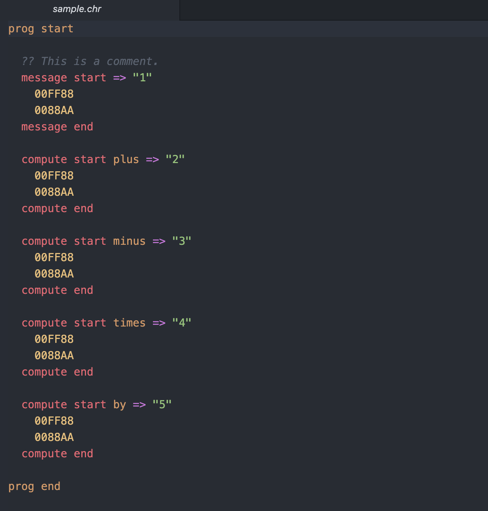

<p align="center">
 
</p>

# CHROMOS :rainbow:

[](https://github.com/iamtheblackunicorn/Chromos/actions)

*An esolang that ouputs data through hex numbers.* :rainbow:

## About :books:

A while ago I saw a video about esoteric languages on YouTube.
These languages are programming languages that behave like programming languages
but look nothing like them. So, because I have strange fascination with hexadecimal numbers, I decided to write an interpreter for an esoteric language that outputs numbers
only by using hexadecimal numbers. *Chromos* is that language and this repo contains the
source code for the interpreter for the *Chromos* language. *Chromos* is a language of
my own design and conception.

## Installation :inbox_tray:

### For Mac OSX and Linux
- 1.) Get the Dart SDK from [here](https://dart.dev) and Git.
- 2.) Make sure you can run `dart --version` and `git --version` from the command-line.
- 3.) Clone this repository's source code with this command:
```bash
$ git clone https://github.com/iamtheblackunicorn/Chromos.git
```
- 4.) Change directory into the cloned source code directory with this command: `cd Chromos`
- 5.) Run `dart pub get`
- 6.) Run `dart compile exe bin/chromos.dart`.
- 7.) Run `mv bin/chromos.exe ./chromos`.
- 8.) Change permissions of the executable by running `chmod a+x chromos`.
- 9.) Create a directory called `bubin` in `$HOME`.
- 10.) Move the chromos executable to `$HOME/bubin`.
- 11.) Add the path `$HOME/bubin` to your system's `$PATH` by modifying your shell's `.zshrc` or . `.bashrc`. This file can ususally be found in the directory located in `$HOME`.

### For Windows
- 1.) Get the Dart SDK from [here](https://dart.dev) and Git.
- 2.) Make sure you can run `dart --version` and `git --version` from the command-line.
- 3.) Clone this repository's source code with this command:
```bash
$ git clone https://github.com/iamtheblackunicorn/Chromos.git
```
- 4.) Change directory into the cloned source code directory with this command: `cd Chromos`
- 5.) Run `dart pub get`
- 6.) Run `dart compile exe bin/chromos.dart`.
- 7.) Move the file `chromos.exe` to some directory that is on the system's `%PATH%`.

### Configuring editors :fire:

If you're using the Atom editor, please visit [this repository](https://github.com/iamtheblackunicorn/language-chromos).

## Language tour :book:

*Chromos* is a very minimal language and its programs end in `*.chr`.

### Types

In *Chromos* there is only one type. This type is the hexadecimal number.
This is a number like `FF00FF`.

### Output mechanisms

In *Chromos* there are only two output mechanisms:

- The `message` operator, which is much like the `print` operator in other languages.
- The `compute` operator, which calculates a result from given input.

#### The `message` operator

This block operator gives the user the power to print out messages to the console.
Each hexadecimal number has to be smaller than 26 and correspond to some letter in the
alphabet. If it is not smaller than 26 a number will be displayed. Here's an example:
The arrow and `01` denote the name of this message block. This name has to be an integer.

```text
prog start
  message start => "01"
    00FF56
    987645
  message end
prog end
```

#### The `compute` operator

The compute operator allows you to make basic calculations. Similar to the `message` operator, there is also a block identifier. This identifier has to be an integer!
Different from the `message` operator, you have to say which operation you would like done. Here's an example:

```text
prog start
  ?? Adds up "00FF56" and "987645".
  compute start plus => "01"
    00FF56
    987645
  compute end
prog end
```

### Neccessary operators

So that the interpreter knows where your code starts and ends, each program starts and ends, we have to explicitly declare this by starting each program with `prog start` and ending each program with `program end`. Every block that follows the starting statement has to be indented with two spaces, ***NOT*** tabs!

### Comments

Comments in *Chromos* are written like this:

```text
?? This is a comment.
```

### Complete example

To find a complete example of *Chromos* code, look in the example folder by clicking [here](example/sample.chr).

### Screenshot of a *Chromos* program in Atom

<p align="center">
 
</p>

## Usage :hammer_and_pick:

Once compiled, the tool can be used in the following ways:

- Run an executable:
```bash
$ chromos yourcode.chr
```
- Get version info:
```bash
$ chromos --version
```
- Get helpful info:
```bash
$ chromos --help
```

## Changelog :black_nib:

To view the changelog click [here](./CHANGELOG.md).

## Note :scroll:

- *Chromos :rainbow:* by Alexander Abraham :black_heart: a.k.a. *"The Black Unicorn" :unicorn:*
- Licensed under the MIT License.
